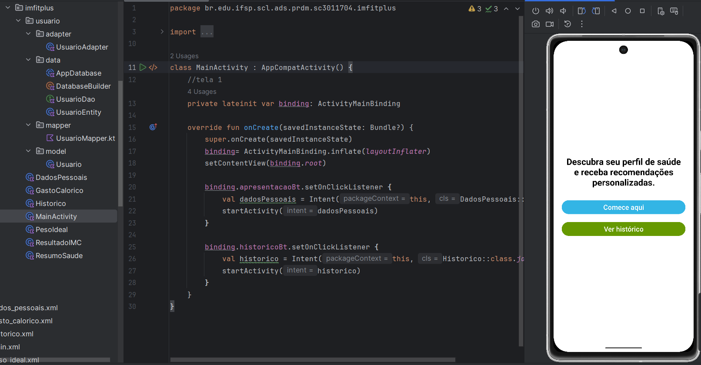

## 🙋‍♂️ Sobre o projeto  

Esse app foi desenvolvido como parte da disciplina **Programação para Dispositivos Móveis** no **IFSP - São Carlos**.  
O objetivo é aplicar conceitos de **Activities**, **Intents explícitas** e boas práticas de programação em Kotlin.  

---

# 🌡️ Conversor de Temperatura  
Aplicativo Android simples que converte temperaturas entre **Celsius**, **Fahrenheit** e **Kelvin**.  

  

---

## ✨ O que ele faz  

- Permite ao usuário digitar uma temperatura em Celsius  
- Selecionar unidade de origem e destino (Celsius, Fahrenheit ou Kelvin)  
- Converter o valor e exibir o resultado em uma segunda tela  
- Validação: caso o campo esteja vazio, mostra um **Toast** com mensagem de erro  
- Navegação entre telas via **Intent explícita** com passagem de parâmetros  

---

## ⚙️ Tecnologias usadas  


- **Kotlin** — linguagem principal  
- **Android Studio** — ambiente de desenvolvimento  
- **Intents explícitas** — para navegação e passagem de dados  
- **ViewBinding** — para facilitar a ligação entre layout e código  

---

## 📂 Estrutura básica  

- `MainActivity.kt`  
  - Toolbar com título da tela  
  - Campo de entrada para digitar a temperatura  
  - Botão **Converter**  
  - Seleção de unidade de origem e destino  
  - Envia os dados via `putExtra()` para a segunda Activity  

- `ResultadoActivity.kt`  
  - Toolbar com título da tela  
  - Exibe o valor original e unidades escolhidas  
  - Mostra o resultado da conversão usando `getFloatExtra()`  

---

## 🧪 Como testar  

1. Clone o repositório:  
   ```bash
   git clone https://github.com/BrenoNLps/conversor-temperatura.git
